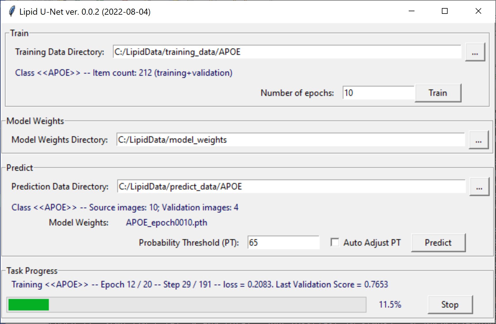

# LipidUNet

Machine Learning suite for training a U-Net model to perform semantic segmentation of biomedical images.

*Andrei Volkov, Kapil Bharti, Davide Ortolan, Arvydas Maminishkis (NEI/NIH)*

### Acknowledgements

This code is partially based on [Pytorch-UNet](https://github.com/milesial/Pytorch-UNet)
implementation distributed under GPL-3.0.

Original paper: [U-Net: Convolutional Networks for Biomedical Image Segmentation *by
Olaf Ronneberger, Philipp Fischer, Thomas Brox*](https://arxiv.org/abs/1505.04597).

## Installation and setup

The binary distribution is currently available for Windows x64 only, it comes in form of a .zip archive
`LipidNet-X.X.X.zip`. Simply unzip it into a local directory, navigate there, find `LipidNet.bat`
and double-click on it. You may also want to create a shortcut for it (Rigth-click, then *Create Shortcut*)
and then move it to your desktop.

If your system has a GPU compatible with CUDA 11.3, the application will automatically take advantage of it.
You don't need to install CUDA itself, it comes with the packaging.

## Data Preparation
Data for training and predictions must be organized in a directory structure like this:

## Training

To train the model, run the application and select one of the directories named after a data class under
`training_data/` as *Training Data Directory*. Select a directory where you want the trained models to be stored
as *Model Weights Directory*. The application will perform data validation and display the number of data items
(pairs of source and mask images) available for training and validation. There must be at least 10 such items.

If you see a message like `Class <<APOE>> -- Item count: 212 (training+validation)`, you are ready to start the training.
Select the desired number of epochs, and click `Train`. Each epoch will have a number of steps determined as the number
of available training items times 0.9. Total number of steps for usable results is about 500-1000 (or more), so divide
this number by the training data set size to get the number of epochs necessary for training.

After each epoch a checkpoint (model weights) file is saved in the *Model Weights Directory*:
`APOE_epoch001.pth`, `APOE_epoch002.pth`, `APOE_epoch003.pth`, etc. You may want to manually delete older epoch files,
and keep only the last one, which will be used for predictions. You can also continue training by simply selecting
another number of epochs and clicking `Train`. If a previous model weights file is present, it will be loaded and
training will continue from this point.

## Predictions

To make predictions, place source images in sub-directory `imgs/` of a data class directory under
`prediction_data`, e.g. `C:\LipidData\prediction_data\APOE\imgs`. After that, select the data class
directory `C:\LipidData\prediction_data\APOE` as *Prediction Data Directory* and make sure the *Model Weights Directory*
contains one of the trained data class models, such as `APOE_epoch005.pth`. The application will perform data validation
and display number of images to process as well as model weights file to use.

If you see messages like `Class <<APOE>> -- Source images: 10` and **Model Weights:** `APOE_epoch005.pth`,
you are ready to go with predictions. Press *Predict*, sit back and wait. The results are stored in the directory
`C:\LipidData\prediction_data\APOE\predicted_masks`.

## Setting Up Development Environment

1. Download and install [Miniconda](https://docs.conda.io/en/latest/miniconda.html) or [Anaconda](https://www.anaconda.com/products/individual).

2. Check out **LipidUnet** to a local directory `<prefix>/LipidUnet`. (Replace `<prefix>` with any suitable local directory).

3. Run Anaconda Prompt (or Terminal), cd to `<prefix>/LipidUnet`.

4. Create Conda Virtual Environment (do this once, next time skip to the next step):

	`conda env create --file conda-environment.yml`
   
5. Activate the Virtual Environment:

	`conda activate LipidUnet`
   
6. Start the application:

	`python __main__.py`

To delete the Virtual environment at the Conda prompt, deactivate it first if it is active:

`conda deactivate`

then type:

`conda remove --name LipidUnet`

## Example

Source:

Ground Truth:

ML Model Prediction:

